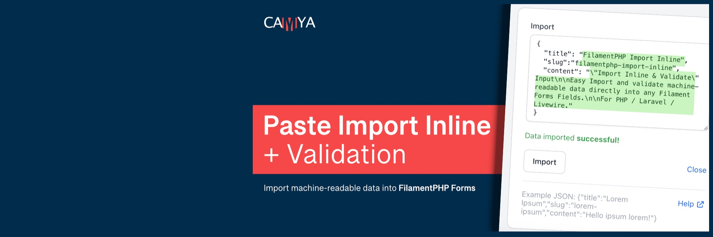
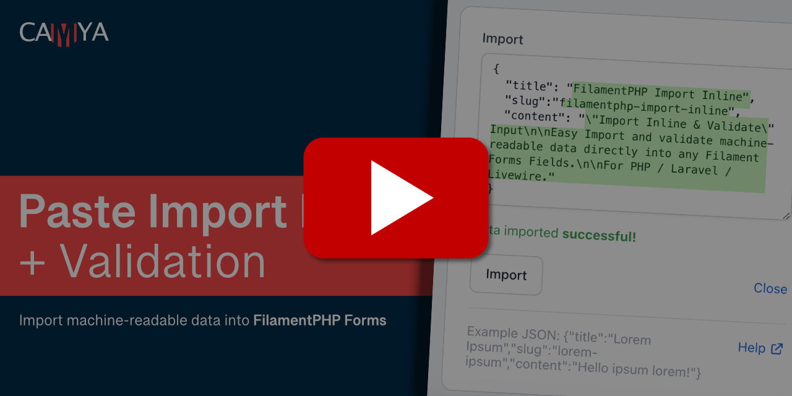
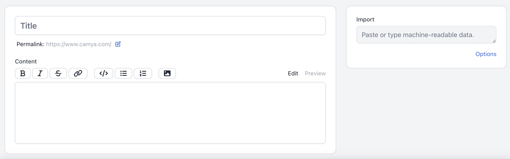
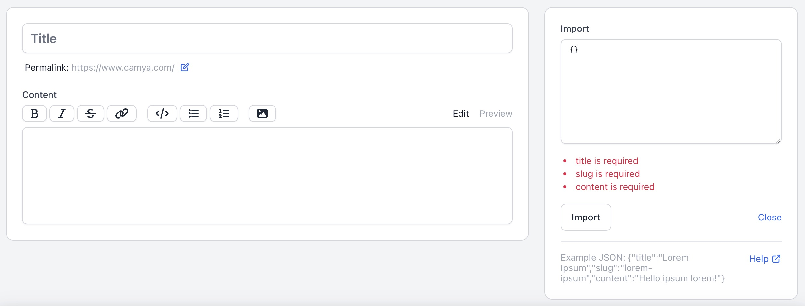
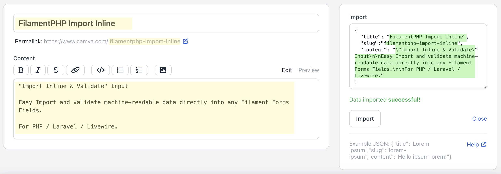

# FilamentPHP Paste "Import Inline" Input - Directly paste, import, and validate machine readable data in form fields. (PHP / Laravel / Livewire)

This package for [FilamentPHP](https://filamentphp.com/) adds the form component `ImportInlineInput`, which allows you to import machine-readable string data directly into your Filament form fields and validate its structure.

> The plugin can automatically **import data via the "on paste" event**, which makes it a great tool for increasing **productivity** when editing content.

You can validate imported data using the standard [Laravel Validation Rules](https://laravel.com/docs/9.x/validation#available-validation-rules).

The plugin comes with two handy importers, [jsonString()](#json-importer---importjsonstring) and [csvString()](#csv-importer-for-comma-separated-values), but you can also just [write and use your own importer](#write-your-own-importer).

Quick jump to the [Table of contents](#table-of-contents).

You can watch a short demo video of the package below.

[](https://www.youtube.com/watch?v=UXmIFjliKik)

Below is an example of how to add the `ImportInlineInput` component to your FilamentPHP resource form. Read the [full documentation here](#table-of-contents).

```php
use Camya\Filament\Forms\Components\ImportInlineInput;
use Camya\Laravel\Importer\Facades\Import;

class PostResource extends Resource
{
    public static function form(Form $form): Form
    {
        return $form->schema([

            ImportInlineInput::make('Import')
                ->afterStateUpdated(
                    function ($state, Closure $set, ImportInlineInput $component): void {

                        $validator = $component->validator();

                        // Try to import JSON from given state
                        try {
                            $importedData = Import::jsonString($state);
                        } catch (\Exception $e) {
                            $validator->setValidationError($e->getMessage());
                        }

                        // Validate imported data.
                        $validatedData = $validator->validate(
                            data: $importedData,
                            rules: [
                                'title' => [
                                    'required',
                                ],
                                'slug' => [
                                    'required',
                                ],
                                'content' => [
                                    'required',
                                ],
                            ],
                            messages: [
                                'title.required' => 'title is required',
                                'slug.required' => 'slug is required',
                                'content.required' => 'content is required',
                            ]
                        );

                        // Set fields with validated data
                        $set('title', $validatedData['title']);
                        $set('slug', $validatedData['slug']);
                        $set('content', $validatedData['content']);

                        $component->statusMessage('Data imported <strong>successful!</strong>');

                    }
                )
                ->dataHelperHtml('Example JSON: {"title":"Lorem","slug":"ipsum","content":"Hello"}')
                ->dataHelperLink('https://www.camya.com/', 'Help')

    }
}
```

The output looks like this: (Watch **[&raquo; Demo Video &laquo;](https://www.youtube.com/watch?v=5u1Nepm2NiI)**)







## Features

- Import and validate any type of machine readable string data.
- Direct **import "on paste"** event for a content editing productivity boost.
- Importers for JSON and CSV included.
- Validation of the structure using Laravel's validation rules.
- All texts customizable and translatable.
- Dark mode supported.
- Fully configurable, see [all-available-parameters](#all-available-parameters).

## Support us

You can support my work with a [donation](https://www.paypal.com/paypalme/epicbundle).

[Follow me on Twitter](https://twitter.com/camyaCom) for DEV updates.

Support the package: Please give it a &#11088; Star on GitHub and on the official
Filament [plugin page](https://filamentphp.com/plugins/import-inline-validate-form), if it's helpful for you.

## Table of contents

- [Installation](#installation)
- [Usage & examples](#usage--examples)
    - [Import and validate data - Step by Step guide](#import-and-validate-data---step-by-step-guide)
    - [How to import & validate array data? Example: Tags, Category IDs](#how-to-import--validate-array-data-example-tags-category-ids)
    - Importer
        - [JSON importer](#json-importer---importjsonstring)
        - [CSV importer (for Comma Separated Values)](#csv-importer-for-comma-separated-values)
        - [Write your own importer](#write-your-own-importer)
        - [How to show a form error, if the import fails?](#how-to-show-a-form-error-if-the-import-fails)
    - [Laravel Validation Rules](#laravel-validation-rules)
    - [**All available parameters**](#all-available-parameters)
- [Changelog](#changelog)
- [Contributing](#contributing)
- [Credits](#credits)

## Installation

You can install the package via composer:

```bash
composer require camya/filament-import-inline
```

If needed, you can publish the config file with:

```bash
php artisan vendor:publish --tag="filament-import-inline-config"
```

## Translation

If needed, you can publish the translation files with:

```bash
php artisan vendor:publish --tag="filament-import-inline-translations"
```

You'll find the published translations here: `trans/vendor/filament-import-inline`

This package is translated
to:

- [English (en)](https://github.com/camya/filament-import-inline/blob/main/resources/lang/en/package.php)

You translated it too? Share your translation on
our [GitHub discussions](https://github.com/camya/filament-import-inline/discussions) page.

## Usage & examples

### Import and validate data - step-by-step guide.

The user input text is sent to the component's `afterStateUpdated()` method and is contained in the `$state` parameter.

**Explanation of the code below:**

1. First set the validator for this component to a variable. 
2. Import the incoming data. If necessary, you can raise a validation error using the `$validator->setValidationError()` method.
3. Add the imported data + validation rules to the `$validator->validate($data, $rules, $messages)` method. 
4. After validation:
    - Validation fails: If validation fails, the template displays the validation errors. 
    - Valid data: If valid, you can set any form field using Filament's `$set('title', $validatedData['title'])` closure method.
5. Use the `$component->statusMessage()` method of the component to set a success message below the form. (You can use Filament's notification system with `Filament::notify('success', 'Data imported');`)


```php
ImportInlineInput::make('Import')
    ->afterStateUpdated(
        function ($state, Closure $set, ImportInlineInput $component): void {

            // 1.
            $validator = $component->validator();

            // 2.
            try {
                $importedData = Import::jsonString($state);
            } catch (\Exception $e) {
                $validator->setValidationError($e->getMessage());
            }

            // 3.
            $validatedData = $validator->validate(
                data: $importedData,
                rules: [
                    'title' => [
                        'required',
                    ],
                ].
                messages: [
                    'title.required' => 'The title is required!',
                ],
            );

            // 4.
            $set('title', $validatedData['title']);
            $set('slug', $validatedData['slug']);
            $set('content', $validatedData['content']);

            // 5.
            $component->statusMessage('Data imported <strong>successful!</strong>');

        }
    )
```

### How to import & validate array data? Example: Tags, Category IDs

In this import example for CSV data (comma separated values) the text input looks like this:

`1,2,3`

You can read the documentation for [CSV import with csvString()](#csv-importer-for-comma-separated-values) here.

1. We import the CSV data with the method `Import::csvString()`. We set the min/max values per line to 3 to avoid wrong input using `csvPerRow:`. [All parameters & return format explained here.](#csv-importer-for-comma-separated-values)
2. We pass only the **first row** of the result to the validation.
3. We set rules for the `tags`, but also for the `tags.*` to validate the array elements.
4. We set messages for `tags` and the `tags.*`.
5. Finally, we `$set()` the `$dataValidated['tags']` array into the target form field in the filament resource. (Here it is the tags field).

```php
ImportInlineInput::make('Tag Importer')
    ->afterStateUpdated(
        function ($state, Closure $set, ImportInlineInput $component): void {

            $validator = $component->validator();

            // 1.
            try {
                $dataInput = Import::csvString(
                    input: $state,
                    csvPerRow: 3,
                );
            } catch (\Exception $e) {
                $validator->setValidationError($e->getMessage());
            }

            $dataValidated = $validator->validate(
                data: [
                    // 2.
                    'tags' => $dataInput['rows'][0] ?? [],
                ],
                // 3
                rules: [
                    'tags' => [
                        'array',
                        'min:2',
                        'max:3',
                    ],
                    'tags.*' => [
                        'integer'
                    ],
                ],
                // 4.
                messages: [
                    'tags.min' => 'Min 2 tags',
                    'tags.max' => 'Max 3 tags',
                    'tags.*.integer' => 'Only add Tag IDs.'
                ],
            );

            // 5.
            $set('tags', $dataValidated['tags'] ?? []);

            $component->statusMessage('Tags imported <strong>successful!</strong>');

        }),
```

### JSON importer - Import::jsonString()

```php
\Camya\Laravel\Importer\Facades\Import::jsonString($input);

jsonString(
    string|null $input
): array
```

- `input:` String input

Use this method to import JSON data like:

```json
{
    "title": "Lorem Ipsum",
    "slug": "lorem-ipsum",
    "tags": [1,2,3,4]
}
```

```php
$output = Import::jsonString(
    data: $input,
);
```

This generates the following array structure:

```php
[
    'title' => 'Lorem Ipsum',
    'slug' => 'lorem-ipsum',
    'tags' => [
        0 => 1,
        1 => 2,
        2 => 3,
        3 => 4,
    ],
]
```

### CSV importer (for Comma Separated Values)

Import comma-separated values using the `Import::csvString()` method.

```php
\Camya\Laravel\Importer\Facades\Import::csvString($input);

csvString(
    string|null $input,
    null|int $csvPerRow = null,
    bool $hasHeader = false,
    string $separator = ',',
    string $enclosure = '"',
    string $escape = '\\',
    bool $csvPerRowAutodetect = true,
): array
```

- Input:` String input
- `csvPerRow:` Specifies the number of values per row. If a row has more or less columns than specified, an exception is triggered.
- `hasHeader:` First row serves as header if true. 
- `separator:` Separator between values. (v1, v2, v3)
- `Enclosure:` Enclosure character for values. ("v - 1", "v2", "v3")
- `escape:` Escape character.
- `csvPerRowAutodetect:` Automatic detection of the number of values per row (set from first row). If a following row has more or less columns, an exception is triggered.

Use this method to import comma separated CSV data as below, e.g. to populate tag IDs in **repeat** fields. Set hasHeader:

```
"Title", "TagID1", "TagID2", "CategoryID"
"Hello", "1", "2", "21"
"World", "5", "6", "65"
```

```php
$output = Import::csvString(
    data: $input,
    csvPerRow: 4,
    hasHeader: true,
);
```

This generates the following array structure:

```php
[
    'header' => [
        0 => 'Title',
        1 => 'TagID1',
        2 => 'TagID2',
        4 => 'CategoryID',
    ],
    'rows' => [
        [
            0 => 'Hello',
            1 => '1',
            2 => '2',
            4 => '21',
        ],
        [
            0 => 'World',
            1 => '5',
            2 => '6',
            4 => '65',
        ],
    ],
]
```

If you set `hasHeader: false`, it parses all lines as rows. 

```php
$output = Import::csvString(
    data: $input,
    csvPerRow: 4,
    hasHeader: false,
);
```

It generates the following array structure:

```php
[
    'header' => []
    'rows' => [
        [
            0 => 'Title',
            1 => 'TagID1',
            2 => 'TagID2',
            4 => 'CategoryID',
        ],
        [
            0 => 'Hello',
            1 => '1',
            2 => '2',
            4 => '21',
        ],
        [
            0 => 'World',
            1 => '5',
            2 => '6',
            4 => '65',
        ],
    ],
]
```
```

### How to show a form error, if the import fails?

The build in importers throw an `\Exception` on failure. Add a try/catch block around them and use the `$validator->setValidationError()` method of the $component to set the form errors.

You can use the the same mechanism, if you [write your own importer](#write-your-own-importer).

```php
try {
    $dataInput = Import::jsonString($importData);
} catch (\Exception $e) {
    $validator->setValidationError($e->getMessage());
}
```

### Write your own importer

You can write your own importer. Feel free to [share your importer](https://github.com/camya/filament-import-inline/discussions) with our GitHub community.

A good starting point is the [Import and validate data - "Step by Step guide"](#import-and-validate-data---step-by-step-guide).


### Laravel Validation Rules

 You can use the official [Laravel Validation Rules](https://laravel.com/docs/9.x/validation#available-validation-rules).

### All available parameters

This plugin offers many parameters to configure it's behavior.

>HINT: Read the ["Step by Step guide" - How to import and validate data](#import-and-validate-data---step-by-step-guide).

```php
ImportInlineInput::make('Import')

    // Import / Validate / Set your data here.
    ->afterStateUpdated(
        function ($state, Closure $set, ImportInlineInput $component): void {
            // ...
        }
    )

    // Sets the label above the form element.
    ->label('Inport Data')

    // Hide the label above the form element.
    ->disableLabel()

    // Help text for the detail panel.
    ->dataHelperHtml('Help <strong>text</strong>')

    // Link URL and Title for the detail panel.
    ->dataHelperLink('https://www.camya.com/', 'Specs')
    
    // Form field placeholder text for the "detail input" field.
    ->dataPlaceholder('Insert data here.')

    // Form field placeholder text for the "paste input" field.
    ->placeholder('Paste or insert valid data.')

    // Deactive listening for "on paste" on "paste input" field.
    ->insertOnPaste(false)

    // Default count of rows of the "paste input" field.
    ->dataInputRows(2)
```

## Changelog

Please see the [release changelog](https://github.com/camya/filament-import-inline/releases) for more information on what has changed recently.

## Contributing

Want to implement a feature, fix a bug, or translate this package? Please see [contributing](.github/CONTRIBUTING.md)
for details.

## Security Vulnerabilities

Please review [our security policy](../../security/policy) on how to report security vulnerabilities.

## Credits

- [Andreas Scheibel (camya)](https://github.com/camya) (Developer at  [camya.com](https://www.camya.com)
  / [epicbundle.com](https://www.epicbundle.com))

[FilamentPHP](https://filamentphp.com/)
is based on
[Laravel](https://laravel.com/),
[Livewire](https://laravel-livewire.com/),
[AlpineJS](https://alpinejs.dev/),
and
[TailwindCSS](https://tailwindcss.com/). (aka Tall Stack)

This package was inspired by a package
by [awcodes](https://github.com/awcodes/) and the work of [spatie](https://github.com/spatie/).
Thanks also to [ralphjsmit](https://github.com/ralphjsmit/) for his blueprint that I used to implement the Filament
Component [Pest Tests](https://pestphp.com/).

## License

The MIT License (MIT). Please see [License File](LICENSE.md) for more information.

## Tooling - Development tools I use

- [PHPStorm](https://www.jetbrains.com/phpstorm/) IDE (
    + [Laravel Idea](https://plugins.jetbrains.com/plugin/13441-laravel-idea) Plugin)
- Laravel with [Valet](https://laravel.com/docs/9.x/valet)
  and [Lambo](https://github.com/https://github.com/tighten/lambo/lambo)
- [GitHub Desktop](https://desktop.github.com/)
- Translations with [DeepL](https://www.deepl.com/translator) and [LanguageTool](https://languagetool.org/)
- [Markdown TOC Generator](https://luciopaiva.com/markdown-toc/)
- SVG Icons by [Heroicons](https://heroicons.com/)
- [iTerm2](https://iterm2.com/) Terminal
- [Regex101](https://regex101.com/) - Build, text, debug regex.
- [Affinity](https://affinity.serif.com/) Photo & Designer
- [VSCode](https://code.visualstudio.com/)

[Follow me on Twitter](https://twitter.com/camyaCom)
